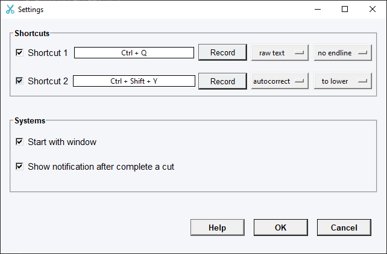

# Window OCR screenshort Tool 
The python application build specific for window to cut image from screenshot and convert it to text. Download windown app at [here](https://studenthcmusedu-my.sharepoint.com/:f:/g/personal/20280078_student_hcmus_edu_vn/EvxCRbBq9zdMszIQ7_thdM0BaxlogvN9xyuwgJF4TOJB3Q?e=YNiqfG).

# Feature
Crop image from screen, convert to text and copy to clipboard, support English and Vietnamese

# Requirement
- autocorrect==2.6.1
- easyocr==1.6.2
- numpy==1.23.3
- Pillow==9.3.0
- PyAutoGUI==0.9.53
- pynput==1.7.6
- pyperclip==1.8.2
- pystray==0.19.4
- screeninfo==0.8.1
- torch==1.13.0
- win10toast==0.9

**For desktop environment**
> pip uninstall opencv-python-headless
>
> pip install opencv-python==4.6.0.66

# Run
> python OCR-S.py

